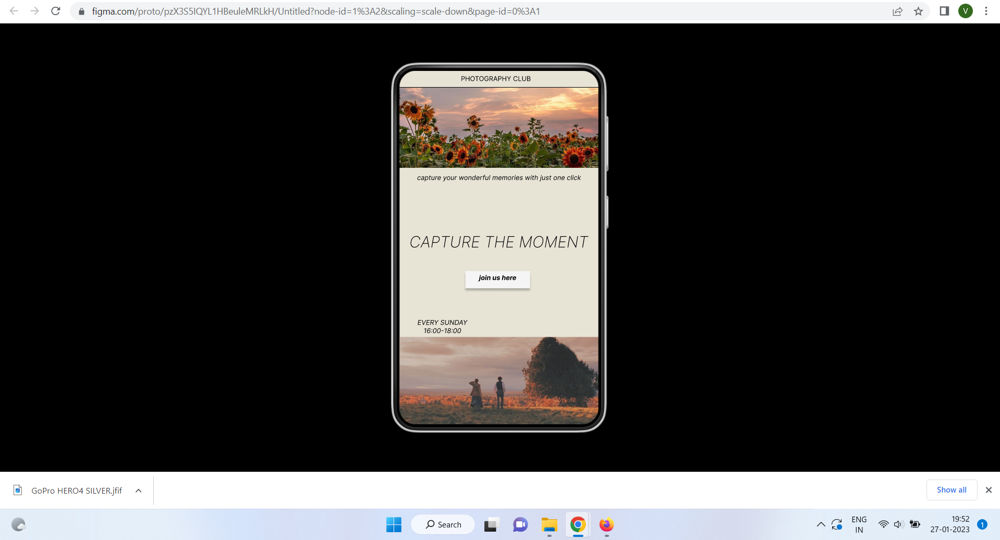
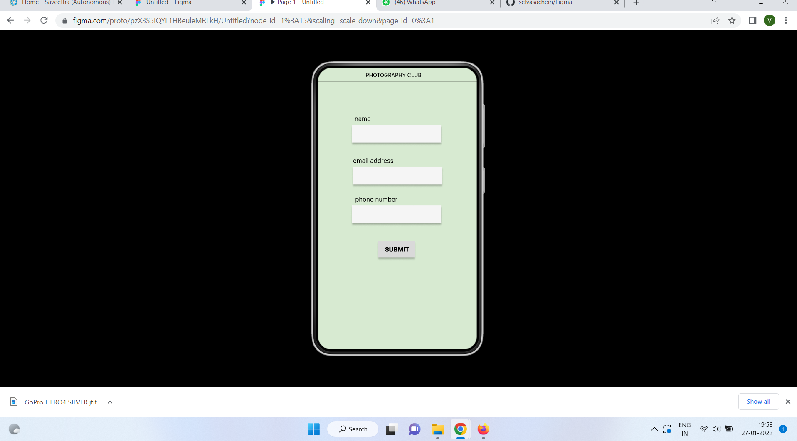
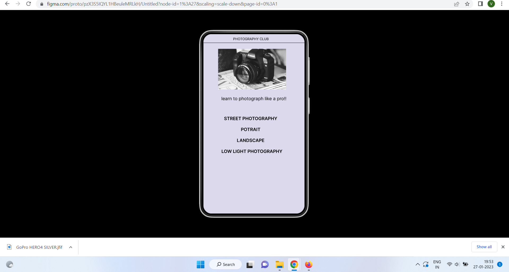

# Event Registration Web Application

## AIM:
To design, develop and deploy a web application for event registration.

## DESIGN STEPS:

### Step 1:
Create a new frame.

### Step 2:
Select any one preset size of your choice.

### Step 3:
Select the shapes you need.

### Step 4:
Import images as needed.

### Step 5:
Create pages based on your need and link them.

### Step 6:

Validate the HTML and CSS code.

### Step 6:

Publish the website in the given URL.

## DESIGN TOOL:
Figma

## code
```
/* Home Page */
position: relative;
width: 360px;
height: 640px;
background: #E7E4D6;

/* Register Page */
position: relative;
width: 360px;
height: 640px;
background: #D7EAD1;

/* Line 3 */
position: absolute;
width: 360px;
height: 0px;
left: 0px;
top: 32px;
border: 1px solid #000000;

/* PHOTOGRAPHY CLUB */
position: absolute;
width: 234px;
height: 22px;
left: 52px;
top: 10px;
font-family: 'Inter';
font-style: normal;
font-weight: 400;
font-size: 12px;
line-height: 15px;
text-align: center;
color: #000000;

/* GoPro HERO4 SILVER 1 */
position: absolute;
width: 242px;
height: 145px;
left: 52px;
top: 53px;
background: url(GoPro HERO4 SILVER.jpg);


/* learn to photograph like a pro!! */
position: absolute;
width: 331px;
height: 30px;
left: 14px;
top: 221px;
font-family: 'Inter';
font-style: normal;
font-weight: 400;
font-size: 16px;
line-height: 19px;
text-align: center;
color: #000000;

/* STREET PHOTOGRAPHY */
position: absolute;
width: 208px;
height: 28px;
left: 64px;
top: 292px;
font-family: 'Inter';
font-style: normal;
font-weight: 600;
font-size: 16px;
line-height: 19px;
text-align: center;
color: #000000;

/* POTRAIT */
position: absolute;
width: 208px;
height: 28px;
left: 64px;
top: 331px;
font-family: 'Inter';
font-style: normal;
font-weight: 600;
font-size: 16px;
line-height: 19px;
text-align: center;
color: #000000;

/* LANDSCAPE */
position: absolute;
width: 208px;
height: 28px;
left: 64px;
top: 370px;
font-family: 'Inter';
font-style: normal;
font-weight: 600;
font-size: 16px;
line-height: 19px;
text-align: center;
color: #000000;

/* LOW LIGHT PHOTOGRAPHY */
position: absolute;
width: 221px;
height: 28px;
left: 62px;
top: 409px;
font-family: 'Inter';
font-style: normal;
font-weight: 600;
font-size: 16px;
line-height: 19px;
text-align: center;
color: #000000;
```
## OUTPUT:




## RESULT:
The program to design, develop and deploy a web application for event registration is completed successfully.